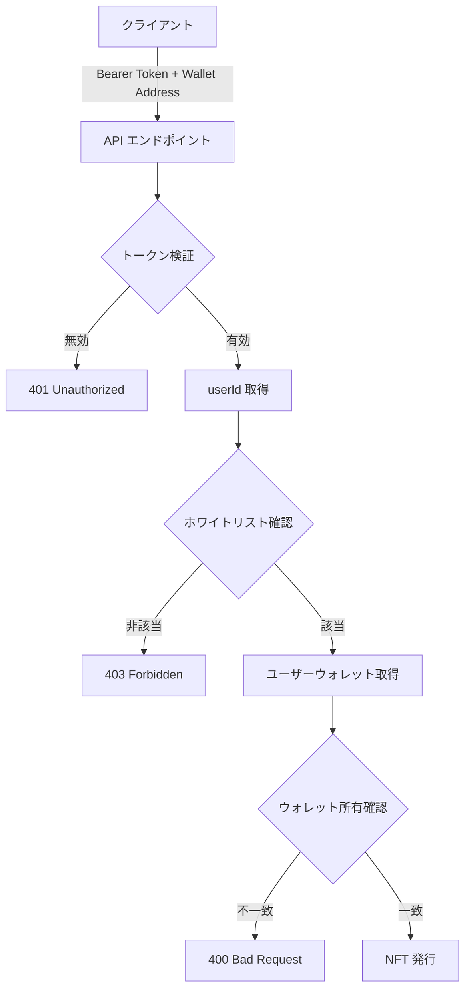

# Privy 認証フロー実装説明書

## 概要

本ドキュメントは、NFT クレーム API における Privy アクセストークン認証の実装内容を説明します。この実装により、クライアントから送信される userId を信頼せず、サーバー側で安全に検証を行います。

## レビューで指摘された問題

> ユーザーがAPIで渡してきたUserIdが間違っていたら、不正にmintされてしまうので、アクセストークンを渡してアクセストークンを使ってServer側でuserIdとwallet addressが正しいか検証する必要があります。

## 実装した解決策

### 1. Bearer トークン認証の導入

**変更前**：
```typescript
// クライアントが送信した privyUserId を信頼していた（セキュリティリスク）
{
  "walletAddress": "...",
  "privyUserId": "user-provided-id" // 偽装可能
}
```

**変更後**：
```typescript
// Authorization ヘッダーから Bearer トークンを取得
Authorization: Bearer <privy-access-token>

// リクエストボディは walletAddress のみ
{
  "walletAddress": "..." 
}
```

### 2. サーバー側での検証フロー



### 3. 実装詳細

#### 3.1 トークン検証（lib/auth/privy.ts）

```typescript
// トークンからユーザー ID を安全に取得
export async function verifyAccessToken(token: string): Promise<{ userId: string }> {
  const privy = getPrivyClient()
  const verifiedClaims = await privy.verifyAuthToken(token)
  
  if (!verifiedClaims.userId) {
    throw new Error('Token does not contain userId')
  }
  
  return { userId: verifiedClaims.userId }
}
```

#### 3.2 ウォレット所有権確認

```typescript
// ユーザーのリンク済みウォレットを取得
export async function getUserAndWallets(userId: string): Promise<string[]> {
  const user = await privy.getUser(userId)
  
  // Privy 埋め込みウォレットを含むすべての Solana ウォレットを取得
  const wallets = user.linkedAccounts
    .filter(account => account.type === 'wallet' && account.chainType === 'solana')
    .map(account => account.address)
    
  return wallets
}
```

#### 3.3 API エンドポイントでの実装（app/api/claim/route.ts）

```typescript
// 1. トークン検証
const accessToken = getAccessTokenFromRequest(request)
if (!accessToken) {
  return NextResponse.json({ error: 'Authentication required' }, { status: 401 })
}

// 2. userId を安全に取得（クライアントの入力を使わない）
const { userId } = await verifyAccessToken(accessToken)

// 3. ホワイトリスト確認
const isWhitelisted = user_whitelist.some(user => user.id === userId)

// 4. ウォレット所有権確認
const userWallets = await getUserAndWallets(userId)
assertWalletBelongsToUser(walletAddress, userWallets)

// 5. すべての検証をパスした場合のみ NFT 発行
```

## セキュリティ上の改善点

1. **userId の偽装防止**
   - クライアントから送信される userId を完全に無視
   - Bearer トークンから確実な userId を取得

2. **ウォレット所有権の保証**
   - ユーザーが実際に所有するウォレットのみ使用可能
   - 他人のウォレットアドレスでの NFT 受け取りを防止

3. **多層防御**
   - トークン検証
   - ホワイトリスト確認
   - ウォレット所有権確認
   - 重複クレーム防止

## Privy 埋め込みウォレットへの対応

### 問題と解決

当初、`walletClientType === 'solana'` でフィルタリングしていたため、Privy の埋め込みウォレットが検出されませんでした。

**修正**：
```typescript
// 変更前（動作しない）
account.walletClientType === 'solana'

// 変更後（正しく動作）
account.chainType === 'solana'
```

これにより、以下のような Privy 埋め込みウォレットも正しく認識されます：
```json
{
  "type": "wallet",
  "chainType": "solana",
  "walletClientType": "privy",
  "connectorType": "embedded"
}
```

## 環境変数設定

### ALLOW_UNLINKED_WALLETS（非推奨）

この環境変数は開発時の一時的な回避策として実装されましたが、現在は不要です：

- **デフォルト値**: `false`
- **推奨設定**: `false` または未設定
- **用途**: Privy にリンクされていないウォレットでのクレームを許可（開発用）

本番環境では、この環境変数を設定せず、適切なウォレット検証を行うことを推奨します。

## まとめ

この実装により、以下が実現されました：

1. ✅ クライアントから送信される userId の偽装を防止
2. ✅ サーバー側でのセキュアな認証・検証
3. ✅ Privy 埋め込みウォレットのサポート
4. ✅ 多層的なセキュリティ検証

レビューで指摘されたセキュリティ上の懸念は完全に解決され、安全な NFT クレームシステムが実装されています。